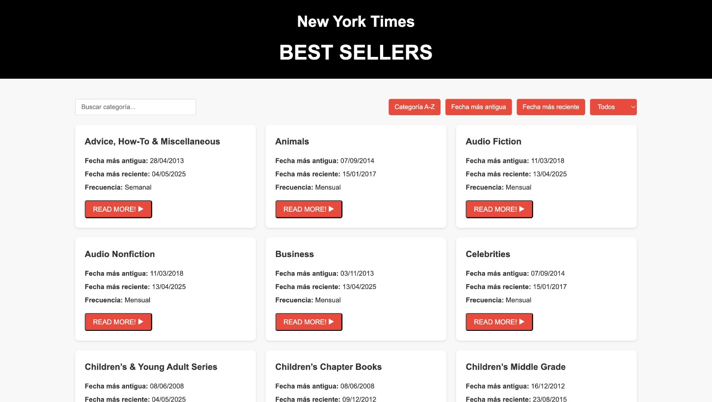

# Biblioteja-js

Una aplicación web que muestra los libros más vendidos según The New York Times.

## Descripción

Biblioteja-js es una aplicación web que permite explorar las listas de los libros más vendidos de The New York Times. Los usuarios pueden navegar por diferentes categorías de libros, buscar por título o autor, y filtrar las listas por frecuencia de actualización.

## Características

- Visualización de todas las categorías de libros más vendidos
- Búsqueda de categorías
- Filtrado por frecuencia (semanal/mensual)
- Ordenamiento de categorías por nombre y fecha
- Visualización de libros por categoría
- Búsqueda de libros por título y autor
- Paginación de resultados
- Interfaz responsiva y amigable

## Tecnologías

- HTML5
- CSS3
- JavaScript (Vanilla)
- API de The New York Times Books

## Uso

1. Abre `index.html` en tu navegador
2. Explora las diferentes categorías de libros
3. Haz clic en una categoría para ver los libros correspondientes
4. Utiliza los filtros para encontrar libros específicos

## Desarrollo

Este proyecto fue desarrollado como ejercicio práctico para demostrar el uso de APIs externas y manipulación del DOM con JavaScript puro, sin dependencias de frameworks.